{width="2.5680555555555555in"
height="0.8270833333333333in"}

Jenkins :is an open source automation server. It helps automate the
parts of software development related to building, testing, and
deploying, facilitating continuous integration, and continuous delivery.
It is a server-based system that runs in servlet containers such as
Apache Tomcat.

**Pipeline**

-   A series of steps executed in a sequential and logical manner.

-   Example

    -   Developer pushes their code in a central repository

    -   That code should be fetched automatically by a server

    -   Once the code has been fetched, then a build should be created
        > from the fetched code, if needed.

    -   Once the build is successful, it will generate an output of
        > file(s) which is considered as an artifact

    -   Then a testing script can be attached on the artifact using
        > tools Appium, JUnit, etc to create a test report, if needed,
        > to be sent to developers.

    -   Once the code has been approved, meaning it is good for
        > deployment (staging or production), it is sent to the
        > deployment platform

    -   The deployment platform can be different based on the
        > requirement (Physical Server, VM, Container Environment, or m
        > a managed Kubernetes environment)

**Continuous Integration (CI)**

**Continuous Delivery (CD)**

**Continuous Deployment (CD)**

**Code → Build → Test → Release → Deploy → Ops → Monitor**

**QA Pipeline**

Fetch Code From Repo → Create a build → Attach the testing script →
Deploy to a testing environment → Generate Report → Share report with
developers → Developer pushes a new version to repo

**Code → Build → Test → Release → Manual Approval (Release Gate)→ Deploy
(Staging/Testing/Production)**

**Code → Build → Test → Release → Automated Deployment
(Staging/Testing/Production)**

Jenkins Project

Create Private repo on git

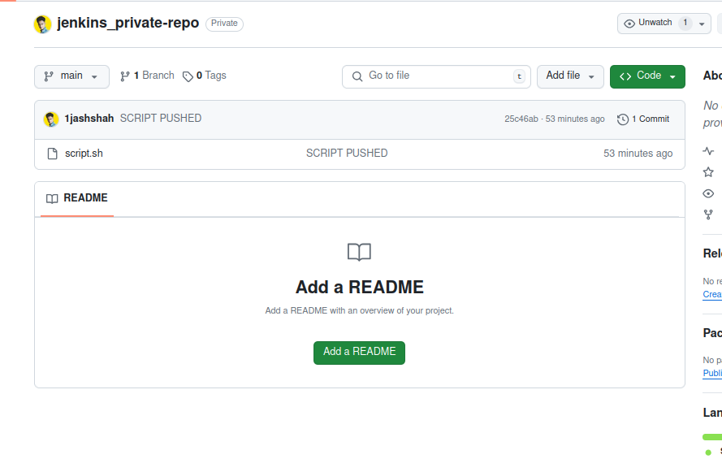{width="6.5in"
height="4.125in"}

In that repo push script.sh

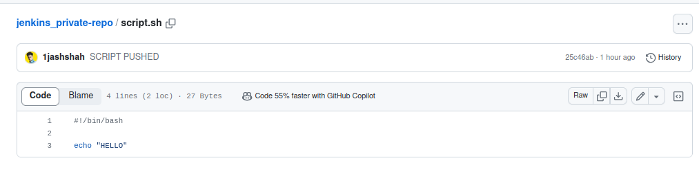{width="6.5in"
height="1.75in"}

Git repo url paste

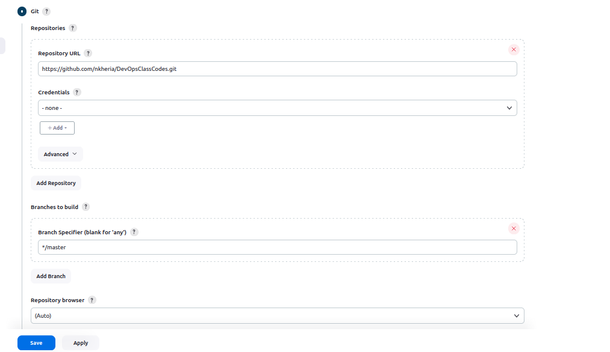{width="6.5in"
height="3.763888888888889in"}add credentials

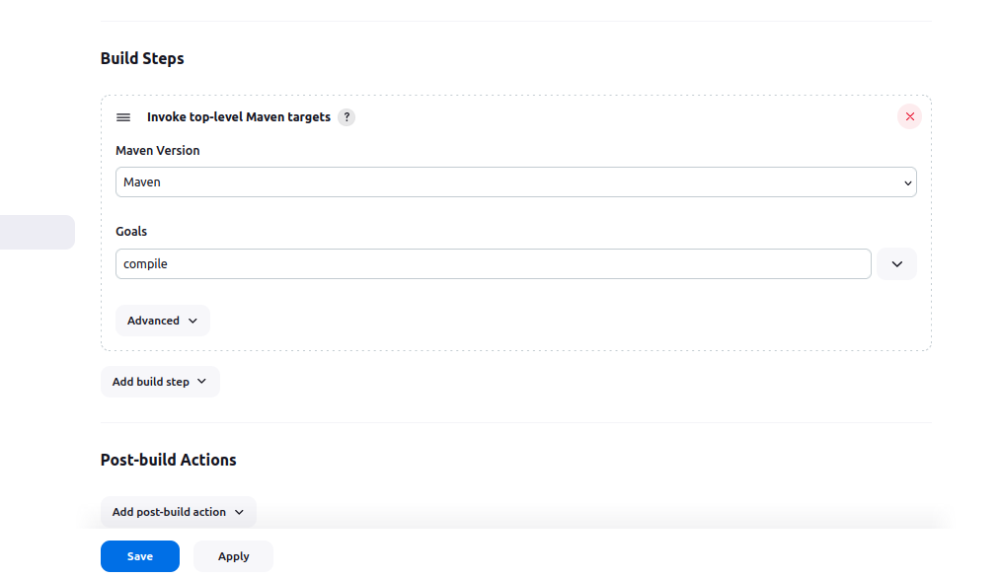{width="6.5in"
height="3.763888888888889in"}

Build steps EXECUTE SHELL

Project 2

Paste link of repo

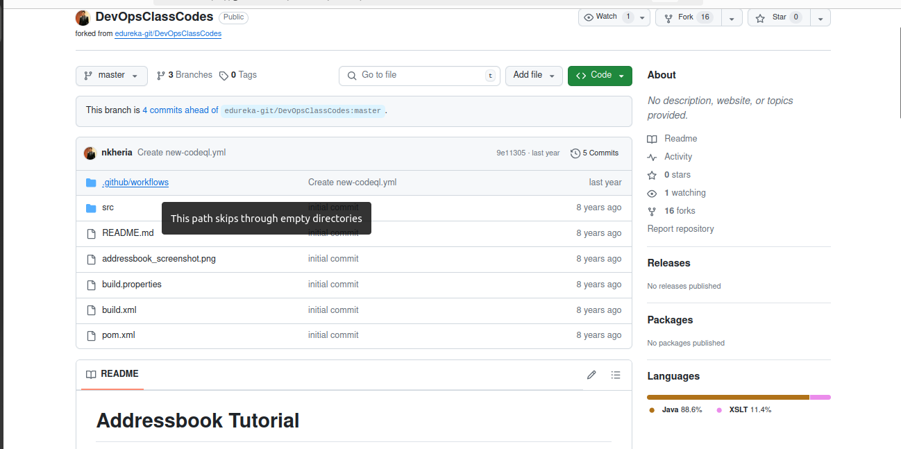{width="6.5in"
height="3.236111111111111in"}

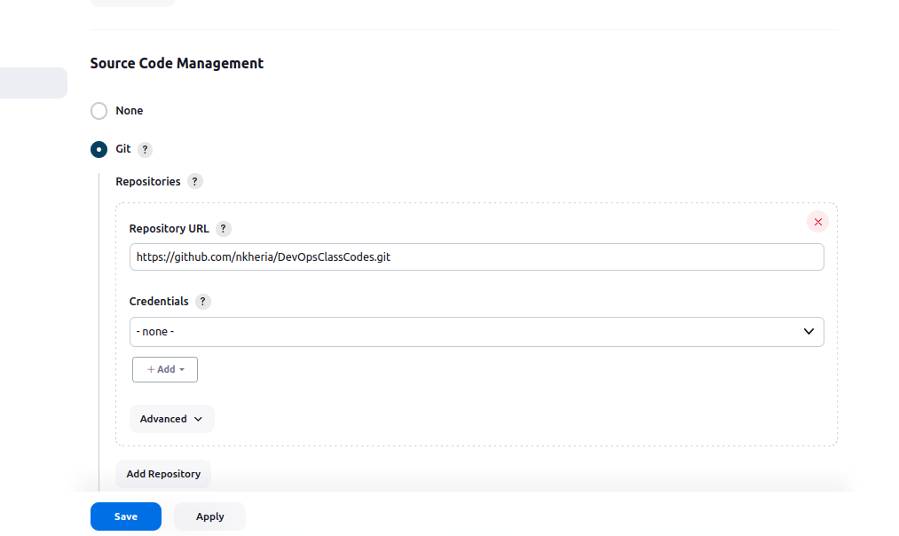{width="6.5in"
height="3.875in"}

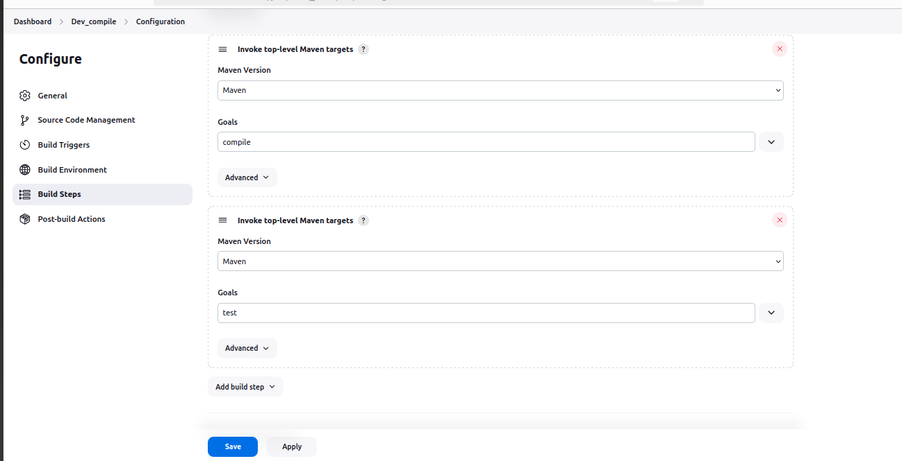{width="6.5in"
height="3.3333333333333335in"}

Follow steps as above

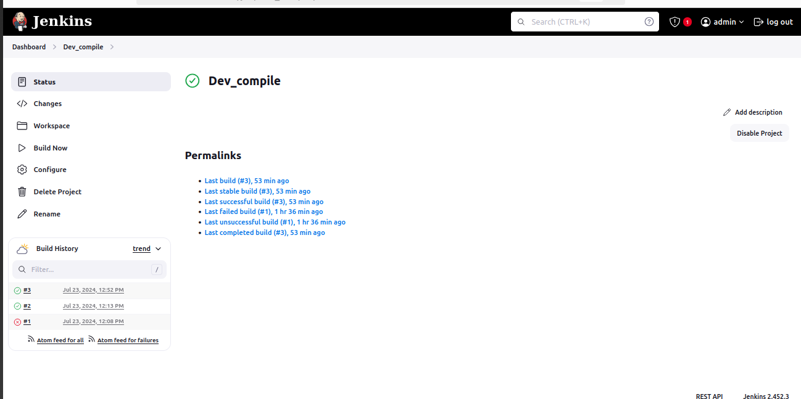{width="6.5in"
height="3.236111111111111in"}

Project 3

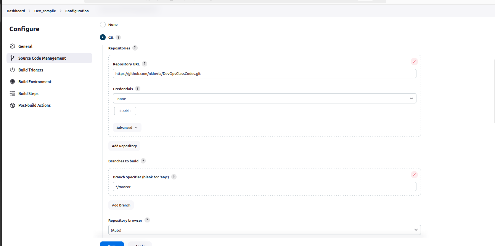{width="6.5in"
height="3.236111111111111in"}

Project 3

Download Plugins of Build pipeline

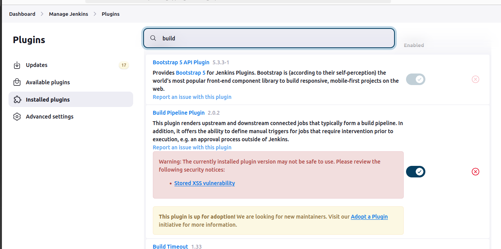{width="6.5in"
height="3.236111111111111in"}

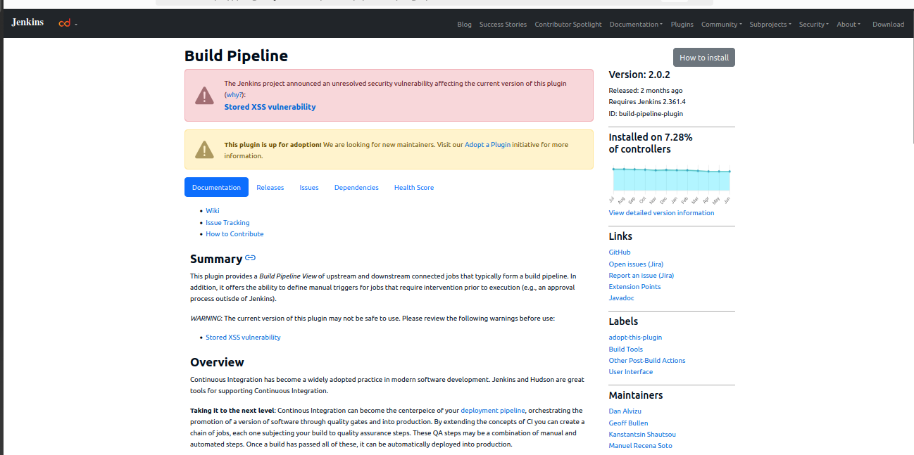{width="6.5in"
height="3.236111111111111in"}

CLick on + icon of jenkins dashboard

Create a new view

{width="6.5in"
height="3.236111111111111in"}

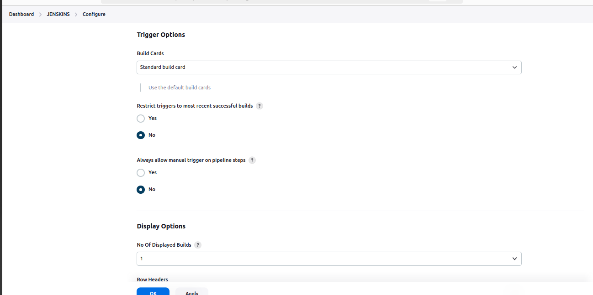{width="6.5in"
height="3.236111111111111in"}

Configure according to your need.

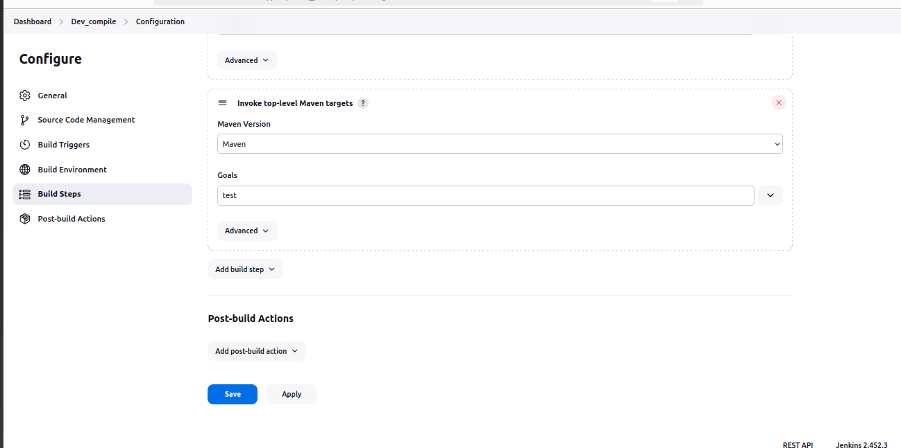{width="6.5in"
height="3.236111111111111in"}

Select Apply and save

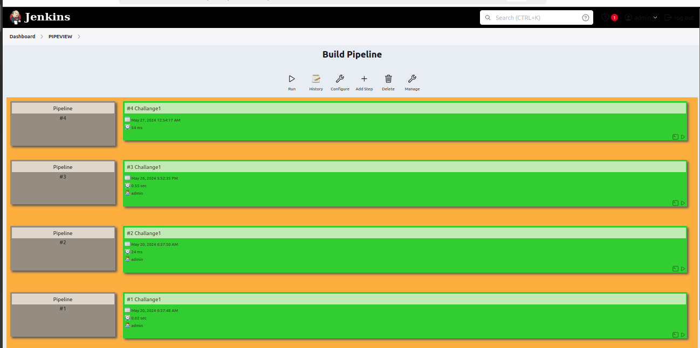{width="6.5in"
height="3.236111111111111in"}
